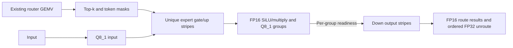

# Persistent execution for Flash-Next GGUF on SM70

This note compares primary publications and source with the
[measured MTP4 ledger](flashnext_mtp4_structural_costs.md). It proposes an
execution redesign; it does not report a working persistent SM70 kernel or
an end-to-end speedup. The accepted device-KV reference remains C1
17.8493 ms/round and C4 42.4171 ms/round. Reaching C1 12 ms requires a
5.8493 ms reduction under this frozen contract.

## What the measurements establish

Small, repeatedly terminated weight streams are a plausible structural
bottleneck. A large LM-head stream achieves much better effective bandwidth
than most layer-local work. However, compulsory operand bytes divided by
profiled service time are **effective bandwidth**, not measured HBM traffic.
Repeated expert reads may hit L2, shared work overlaps the routed path, and
HC service includes communication and polling. Dividing total bytes by node
count also mixes weight-reading kernels with metadata-only kernels.

The target envelope is about 13.9 ms in the low-overhead trace. Visible gaps
are below 1.3 ms. Removing gaps alone cannot meet the round objective; the
redesign must improve execution inside active kernels and overlap real
dependencies. Typical graph-entry skew is already small: the diagnostic
capture's median/p90 is 0.031/0.044 ms. An outlier does not establish a
recurring host-side bottleneck.

The current selected expert path already quantizes input once, fuses
gate/up with FP16 SiLU/multiply and optional Q8 intermediate output, and
fuses down with weighted unroute. It issues one CTA per route/row tile
for gate/up and one output stripe per token for down. It does not use
the old token-sort plus M8-padding chain. The relevant remaining problems
are repeated decoding across routes, termination between stages, and
inability to consume an expert's intermediate in pieces.

IQ gate/up also has substantial measured integer/address/lookup instruction
work. A continuous stream alone does not remove that work. The large head
uses canonical affine decoding; its bandwidth cannot prove that IQ decoding
has no instruction bottleneck.

## Primary sources and transferable mechanisms

### MonoMoE

[The paper](https://arxiv.org/html/2609.04244v1) organizes work by expert
weight stripes, with tokens on the fine-grained MMA axis. Resident CTAs
visit multiple experts and projections; readiness flags replace phase-wide
barriers. Prefetch continues across expert transitions, while epilogues
overlap the next expert's weight stream. Eliminating routed activation
materialization does not eliminate unused hardware MMA lanes.

The evaluated H200 FP8 path improves complete routed-MoE latency by up to
1.54x and serving TPOT by up to 18.7%. At B=1, effective operator throughput
increases from 10.62% to 21.20% of peak. This is evidence for the scheduling
idea, not evidence that persistence alone reaches 80% or that the same gains
hold on V100.

The inspected FlashInfer commit is
`8e39ceb390302b0d1eeb5ccca6787f4b688efc9a`.
Its [host wrapper](https://github.com/flashinfer-ai/flashinfer/blob/8e39ceb390302b0d1eeb5ccca6787f4b688efc9a/csrc/fused_moe/monomoe/monomoe_wrapper.cuh)
receives precomputed BF16 router logits. **Router matrix multiplication is
outside this entry point.** The
[binding](https://github.com/flashinfer-ai/flashinfer/blob/8e39ceb390302b0d1eeb5ccca6787f4b688efc9a/csrc/fused_moe/monomoe/monomoe_binding.cu)
exposes E256/N512/K2048, M<=8, top-k<=8; this differs from the paper's
generated multi-shape implementation. It cannot serve E512/N160/K2560,
top-10 or M20 directly.

The [kernel](https://github.com/flashinfer-ai/flashinfer/blob/8e39ceb390302b0d1eeb5ccca6787f4b688efc9a/csrc/fused_moe/monomoe/src/moe.cuh)
uses TMA/WGMMA, FP8 intermediates, scale sentinels, and floating atomic
output accumulation. Those are not the numerical or hardware contract of
the current SM70 path. It also relies on a timing margin between accumulator
zeroing and later atomic updates. A new implementation must establish
ordering explicitly, retain valid zero-valued intermediates, and preserve
deterministic output reduction.

### Hazy Research Megakernels

The [original Llama-1B report](https://hazyresearch.stanford.edu/blog/2025-05-27-no-bubbles)
measures about 1.3 us launch/teardown overhead with CUDA graphs on H100,
versus 2.1 us on a stream. Its interpreter assigns each SM a reusable
instruction sequence, pages shared memory, and starts the next weight load
as soon as pages become available. Chunk counters allow down projection
to consume portions of the preceding intermediate.

The reported 78% bandwidth utilization and nearly 2.5x speedup over vLLM
are for Llama-3.2-1B, BF16, B1, short context and no speculation. They are
not Flash-Next IQ/TP4 measurements. The same report still attributes a large
part of its B200 runtime to activation publication and readiness checking:
a megakernel replaces kernel boundaries with another synchronization cost.

The inspected [source](https://github.com/HazyResearch/Megakernels/tree/7309cec801537b61fea3b50d7dfe454a6cde578e)
provides explicit page ownership and release in
`include/controller/page_allocator.cuh` and instruction-specific preloads in
`demos/low-latency-llama/matvec_pipeline.cuh`. The demo builds SM90a/SM100a.
The transferable parts are page lifetime and chunk ownership; its TMA,
barrier primitives and shared-memory capacity need replacement on SM70.

### Mirage Persistent Kernel

[MPK](https://arxiv.org/html/2512.22219v1) builds an SM-task dependency graph
from producer/consumer tensor regions. Event fusion removes redundant
notifications. Ready work uses dynamic dispatch; predictable work is
preassigned to avoid the extra worker/scheduler handoff. A worker checks
ready work before waiting on its next static task. Communication becomes
transfer/signal and local-reduction tasks instead of an opaque collective.

The A100 Qwen3-8B example is 14.5 to 12.5 ms/token, with an estimated
10 ms parameter-read floor. This is useful evidence that the approach
extends beyond Hopper, but not a V100 result. The published runtime reserves
four SMs for schedulers and uses 32 KB shared pages; this resource allocation
would be expensive on an 80-SM GPU with only 96 KB shared memory per SM.

Inspected commit: `f9eb70c254acefc9f3667b2a973d0dcf25471fce`.
[Device-scope release/acquire atomics](https://github.com/mirage-project/mirage/blob/f9eb70c254acefc9f3667b2a973d0dcf25471fce/include/mirage/persistent_kernel/mpk_atoms.cuh)
are useful synchronization references. The runtime's compute tasks target
Ampere and newer, and its
[fallback shared-memory budget](https://github.com/mirage-project/mirage/blob/f9eb70c254acefc9f3667b2a973d0dcf25471fce/include/mirage/persistent_kernel/runtime_header.h)
exceeds V100's capacity. A direct library integration is not an SM70 implementation.
NVSHMEM integration also needs topology and graph validation; persistent
execution does not remove the TP collective's mathematical dependency.

### FLUTE

[FLUTE](https://arxiv.org/html/2407.10960v1) rearranges quantized bits offline
to match the consumer fragment, combines scalar lookups into vector lookups,
replicates LUTs to distribute bank access, and uses Stream-K to balance
work. Its reported gains compare particular scalar-LUT workloads and
baselines, rather than IQ3 expert chains.

The inspected [configuration](https://github.com/HanGuo97/flute/blob/9eb83a12d56949bbe7fe9c836ba97a67bd1e3761/flute/csrc/config.hpp)
uses SM80 `cp.async` and vectorized/replicated scalar tables. IQ3_S/XXS and
IQ2_S encode correlated vectors with separate signs and subscales. Their
integer books are 2/1/8 KB respectively; replicating an 8 KB book 32 times
already exceeds SM70's entire shared-memory capacity. Reuse the layout and
bank-distribution principles within a persistent decoder. Do not expand
weights or repeat an already rejected LUT-duplication experiment without new
bank-conflict and occupancy evidence.

### EcoSpec

[EcoSpec](https://arxiv.org/html/2607.12696v1) chooses draft-tree paths using
predicted marginal expert cost as well as draft probability. Its expert
buffer tracks coverage of candidate paths, rather than defining a GPU
expert-weight cache. It retains target verification rules but changes which
drafts are submitted.

The Qwen3-235B greedy table reports 1.36x over autoregressive decoding,
versus EAGLE-3's 1.22x: the relative improvement is about 11.5%, not 36%.
The paper also compares with DeepSeek MTP, but its estimated verification
bytes decrease only about 1%, and mean acceptance length changes from
2.85 to 2.79. A fixed greedy MTP chain has no alternative branches to select
without changing drafting. This is not an immediate optimization compatible
with the unchanged acceptance benchmark. The directly useful lesson is to
measure expert unions and accepted tokens together.

## Opportunity sized from the actual routes

Target M5 has 50 routes and an average 36.17 unique experts per layer.
74.48% of unique experts receive one token. A weight-major decoder should
share decoded words for repeated experts while keeping single-token experts
efficient, rather than forcing every expert through a full M5 computation.

| Gate/up plus down | Operand MB/round/card |
| --- | ---: |
| Route-issued, before cache reuse | 1249.41 |
| Unique-expert compulsory | 901.19 |
| Potential reduction in issued reads | 348.22 (27.9%) |

The following is a bandwidth-only scenario, not a prediction. It omits
instruction, publication and reduction cost and uses compulsory bytes.

| Assumed sustained GB/s | Weight-read ms | Gap from 2.722 ms profiled expert service |
| --- | ---: | ---: |
| 450 | 2.003 | 0.719 |
| 600 | 1.502 | 1.220 |
| 750 | 1.202 | 1.520 |
| 900 | 1.001 | 1.720 |

Decoder reuse and bandwidth improvement cannot be counted twice. Router
projection/top-k/input quantization have about 1.22 ms additional service,
but the first 0.71 ms is outside the currently shipped MonoMoE boundary.
Shared-expert gate/up already overlaps routed work; removing its service
does not automatically shorten the round. MoE alone does not establish the
5.85 ms saving needed for 12 ms/round.

HC remains a separate large opportunity: 3.008 ms service versus overlapped
weight and input-wire floors around 0.38 ms each. The kernel already fuses
communication, normalization, down/up and mixing. It has two device-wide
barriers per boundary, and down/up contain global mathematical dependencies.
Adding another enclosing persistent loop will not remove those dependencies.
Use chunk publication and useful work during arrivals; retain global RMS
completion before normalized consumers. Dense projection dependencies and
the four draft calls also need separate structural improvements.

## First implementation boundary

Start with a complete local routed-MoE chain, retaining TP4 and the current
weight banks. Include top-k/metadata and Q8 input preparation when their
existing numerical behavior can be preserved. Keep router GEMV as an
explicit prerequisite initially; measure a later producer integration
separately. This avoids assigning an unimplemented router saving to the
expert redesign.

1. Build a compact expert-presence list plus a token bitmask and original
   route positions. An M20 mask still fits in 32 bits. Preserve top-k score,
   tie, normalization and route order. Do not sort or gather token features.
2. Launch a resident worker grid bounded by measured occupancy. Each worker
   visits `(expert, output stripe)` tasks, loads IQ words once and applies
   them to the expert's selected tokens. Factor the existing shared GGUF
   integer decoder; do not create a second set of quantization formulas.
3. Produce 32 intermediate rows together, preserving FP16 gate/up rounding,
   FP16 SiLU/multiply, then the existing Q8_1 conversion. Publish that
   expert/row-group's readiness after its data stores. N160 has five such
   groups, allowing down work before every expert completes gate/up.
4. Down workers own output stripes and consume K groups in the retained
   order. Preserve per-route FP16 down rounding before FP32 weighting.
   Sum routes in a fixed order, not arrival-ordered floating atomics.
5. Use available shared pages and registers for the next task's weight
   loads while finishing the current task. SM70 uses ordinary loads and
   software overlap, not TMA or `cp.async`. Account for the
   [Volta resource limits](https://docs.nvidia.com/cuda/volta-tuning-guide/index.html).
   Prove that the extra live state
   does not erase useful occupancy or create spills.

The scheduler must continue runnable gate/up work when a down task's input
is not ready. **A resident grid alone is insufficient to prevent deadlock:**
workers can all wait for gate/up tasks queued behind their own down tasks.
Use nonblocking readiness tests, prioritize ready work, and prove forward
progress for all routing patterns. A simple fixed-shape queue is preferable
to importing an entire model interpreter before this boundary succeeds.

The launch must check register/shared-memory occupancy and admissible
resident blocks. `__launch_bounds__(threads, 1)` is a compiler resource
hint, not proof that the whole grid is resident. Avoid a grid-wide barrier.
Use explicit release/acquire or an equivalent proven store/fence/flag
protocol; `volatile` alone is insufficient. Epoch-tagged flags and workspace
ownership must handle repeated CUDA-Graph replays, zero intermediates and
changed routes without a reset launch or timing assumption.

M5 and M20 require independent resource accounting. Staging all M20 Q8_1
inputs already costs 57.6 KB, before the IQ2_S book, weights and scratch.
Use streamed input groups when necessary. The initial guard may retain the
existing M20 fallback until its chain and full-round tests pass; C4 remains
part of every admission decision.

## Measurements that can accept or reject the design

Use actual M5 and M20 routes/weights and record distinct experts, all-issued
bytes, decoder instructions, achieved occupancy and measured DRAM bytes.
Counter profiles establish mechanism; unprofiled graph timings decide
speed. Include all-equal experts, all-disjoint experts, invalid padded rows,
zero activations, and two changed-input graph replays in isolated numerics.

Separate three variants on the same packed storage and decoder:

- Unique-expert weight/decoder reuse with existing kernel boundaries.
- Persistent scheduling with the same per-route arithmetic.
- Their combination, including chunk handoff and final reduction.

This ablation distinguishes reuse from pipeline continuity. Measure the
complete routed chain and its overlap with the existing shared stream;
router-only timings or the sum of hot-kernel medians cannot admit it.
Require at least 0.5 ms projected round benefit from the chain gate, then
same-wheel C1/C4, target output, teacher-forcing and paired natural-prompt
acceptance. Capture a new trace only after a positive end-to-end result.

The prior HC-to-dense split-K pipeline passed numerics but slowed the chain
from 46.688 to 58.660 us and was rejected. The direct device-history QSA
experiment passed nine clean-wheel GPU tests and saved 0.515/0.448 ms in
synthetic C1/C4 attention chains. Its model control failed while saving
Inductor artifacts because storage filled; no candidate round ran and no
endpoint gain is claimed. These results do not justify reopening local
layout/polling screens already recorded as negative.

## Attribution

The inspected FlashInfer, Mirage and FLUTE repositories use Apache-2.0;
HazyResearch/Megakernels uses MIT. Source snapshots and license files were
retained with the research artifacts. No external implementation is copied
into production by this note. Any future reuse must retain the relevant
copyright/license notices and identify the source revision.
