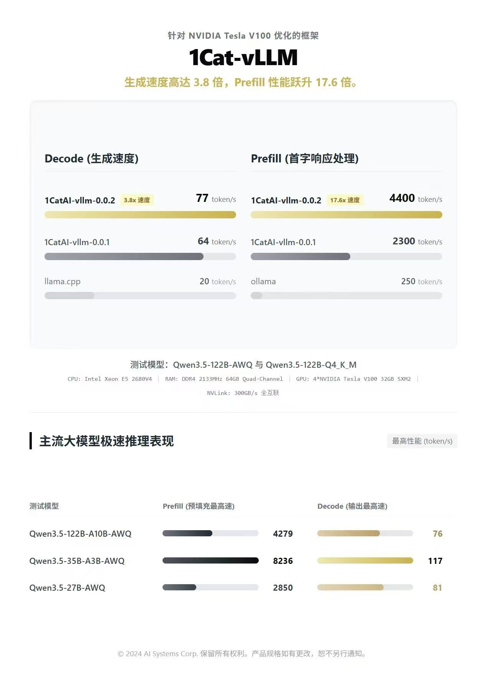
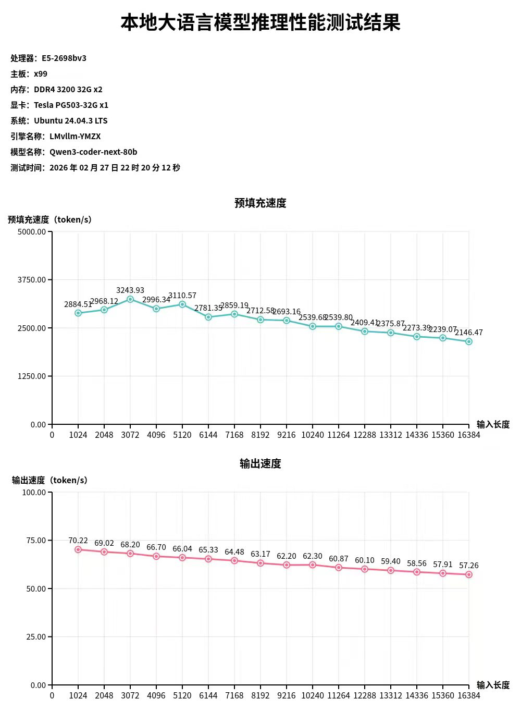
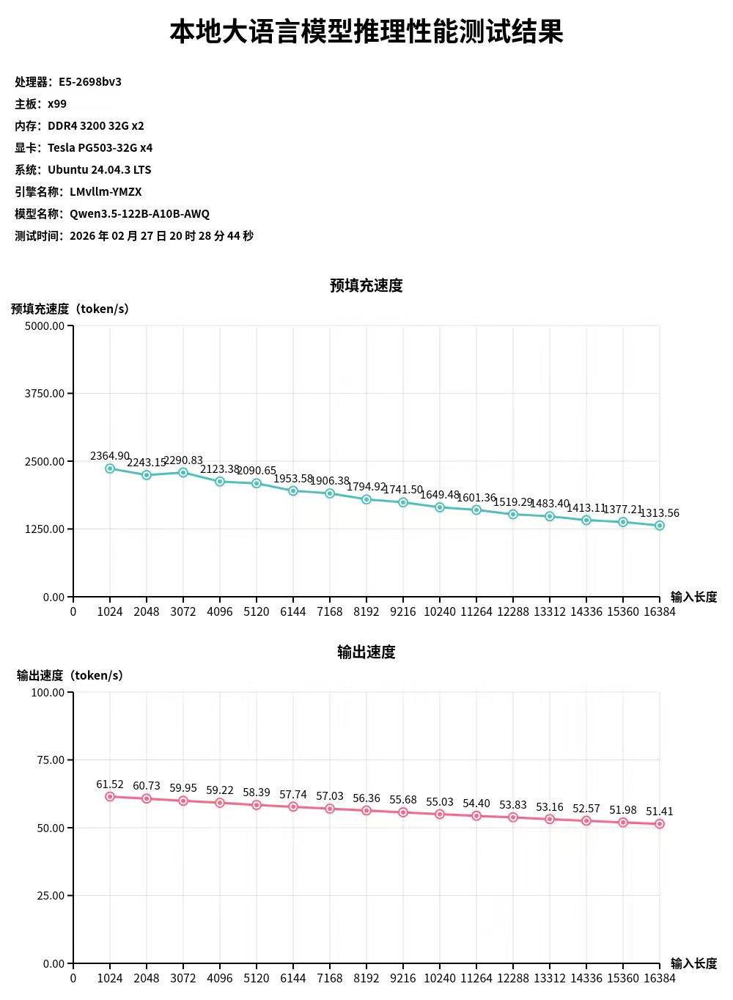
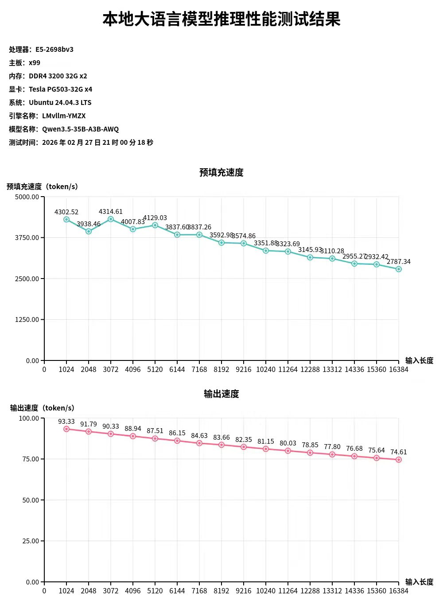
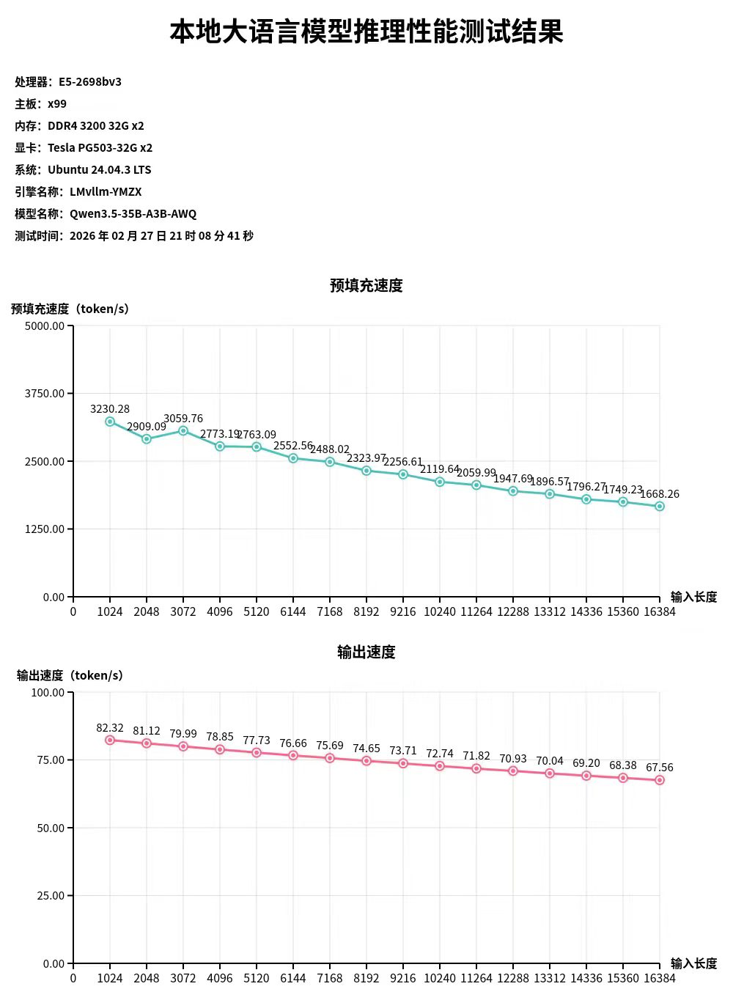
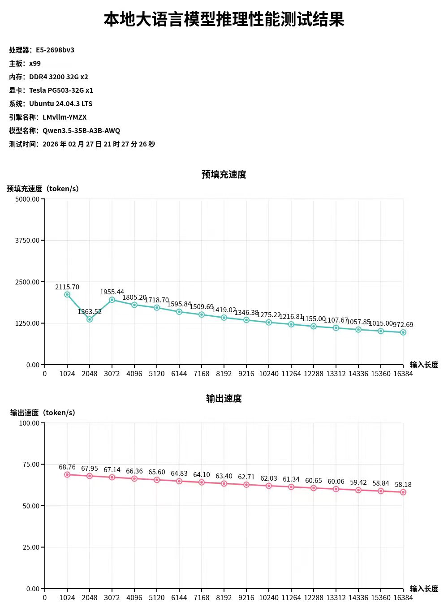

# Effort：性能测试与结果图

本目录用于集中展示 `1Cat-vLLM` 的推理性能测试结果与对比图（主要面向 **Tesla V100 / SM70** + AWQ 场景）。

> 提示：图片是“结果快照”。更详细的环境/参数请以根目录 `README.md` 的「Validated stack / Launch examples / Benchmark method」为准。

## 总览对比

该图展示了在 V100 上 `1CatAI-vllm` 相对其它方案的**生成速度（Decode）**与**首字响应/预填充（Prefill）**对比提升，以及若干主流大模型的极限推理表现概览：

## 本地大语言模型推理性能测试结果

下面这些图展示了随**输入长度**变化的：

- **预填充速度（Prefill, token/s）**
- **输出速度（Decode/输出, token/s）**

### 画廊（点击缩略图查看大图）

| Qwen3-coder-next-80b（单卡） | Qwen3.5-122B-A10B-AWQ（4 卡） | Qwen3.5-35B-A3B-AWQ（4 卡） |
| --- | --- | --- |
|  |  |  |
| Qwen3.5-35B-A3B-AWQ（2 卡） | Qwen3.5-35B-A3B-AWQ（单卡） |  |
| --- | --- | --- |
|  |  |  |

